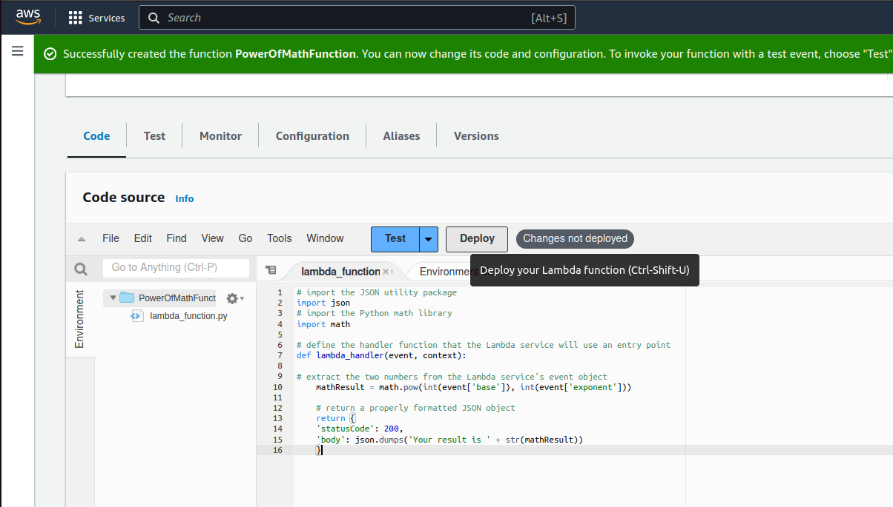
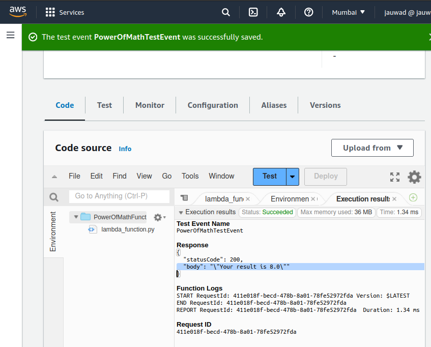

# Power Of Math - Amazon Web Services

## Lab Overview And Architecture


<br>

## Table of Contents
+ [About](#about)
+ [Setup AWS Amplify](#setup_AWS_Amplify)
+ [Setup AWS Lambda Function](#setup_AWS_Lambda_Function)   
+ [Setup Amazon API Gateway](#ssetup_Amazon_API_Gateway)   

## About <a name = "about"></a>
In this project, we'll be using 5 AWS Services as below to build an end to end web application. 

* AWS Amplify
* AWS Lambda
* Amazon API Gateway
* Amazon DynamoDB
* AWS Identity & Access Management (IAM)
  
This will be a super simple application but  it ties together all the components you need to build a much larger real world application.  This  takes two difffernet numbers, a base and an exponent, and it is going to return the result the base to the power of the exponent. The reuslt would also be saved in the DynamoDB table in the backend 

## Setup AWS Amplify <a name = "setup_AWS_Amplify"></a>

**Create and Host a Web Page**

1. Create a index.html with the code below-
```html
<!DOCTYPE html>
<html>
<head>
    <meta charset="UTF-8">
    <title>To the Power of Math!</title>
</head>

<body>
    To the Power of Math!
</body>
</html>
```
2. Zip up the createf index.html to index.zip
3. In the AWS Console, navigate to Amplify.
4. Choose "Get Started" under the  "Host your web app" option.
   * App name - PowerOfMath
   * Environment name - dev
   * Method - Drag and drop
  
5. Drag and drop the index.zip file
6. Choose "Save and deploy"

You can now go to your domain link to see the simple index.html page


Now we have a live web page the user can navigate to. 


## Setup AWS Lambda Function <a name = "setup_AWS_Lambda_Function"></a>

**Creating the math function using AWS Lambda**

Now we need AWS Lambda to do some math. Enter AWS Lambda.
We'll use a Lambda function i.e code that runs upon some trigger 
its just code or fucntions sitting out there that get run when you need them, there are also serverless! 

1. In the AWS C0nsole, navigate to Lambda.
2. Choose "Create function"
   * Ch0ose function - Author from scratch
   * Function name - PowerOfMathFunction
   * Runtime - Python 3.10 
3. Choose "Create Function" on the lower right
4. Update the default code
```python
# import the JSON utility package
import json
# import the Python math library
import math

# define the handler function that the Lambda service will use an entry point
def lambda_handler(event, context):

# extract the two numbers from the Lambda service's event object
    mathResult = math.pow(int(event['base']), int(event['exponent']))

    # return a properly formatted JSON object
    return {
    'statusCode': 200,
    'body': json.dumps('Your result is ' + str(mathResult))
    }
```


6. Save the code and select "Deploy"
7. Click on the drop arrow beside "Test" to Configure Test Event
   * Test Event Action - Create new event
   * Event name - PowerOfMathTestEvent
   * Event sharing settings - Private
8. Update the Event JSON Test Code
```json
{
  "base": 2,
  "exponent": 3
}
```
9. Select "Save"
10. Select "Test"



## Setup Amazon API Gateway <a name = "setup_Amazon_API_Gateway"></a>

**Invoking the math function with Amazon API Gateway**

As the Lamba function is now created, we now need a way to invoke the lamda function, thee users are not gonna go to the aws console like we just did and run the code. So we need a public end point or a URL that can be called to trigger the function to run and for that we use API Gateway.

This is core service in AWS which we can use to build our own APIs, whether those aare HTTP, REST or WebSocket API

1. Download the premade [index.zip](https://github.com/mohd-jauwad/AWS-PowerOfMath/blob/master/FIles/index.zip)
2. In the AWS C0nsole, navigate to API Gateway.
3. Under "REST API", select "Build"
   * Ch0ose the protocol - REST
   * Create new API - New API
   * API name - PowerOfMathAPI
4. Choose "Create API" on the lower right
imgapi1
5. Click "Actions" >> "Create Method"
6. Click on the dropdown created and select "POST"
7. Select the check mark
   * Integration type - Lambda Function 
   *  Lambda Function - PowerOfMathFunction
8. Select "Save"
9. Add Permission to Lambda Function - Select "OK"
10. Click "Actions" >> "Enable CORS"
11. Click "Enable CORS and replace existing CORS headers"
12. Click "Yes, replace existing values"

    img 2
13. Click "Actions" >> "Deploy API"
   * Deployment stage  - [New Stage]
   * Stage name*  - dev
   * Click "Deploy"
14. Copy the "Invoke URL" and save it on the notepad

img3 

Testing
1. Select "Resources"
2. Select "POST"
3. Click on the lighting bolt under "TEST"

img4

4. Update the Request Body
```json
{
  "base": 2,
  "exponent": 3
}
```
5. Select "Test"

img5


We now want to store the math result some where and return it to the user
WE'll use dynamo DB for that a key-value/NoSQL database

**Using DynamoDB to store and return the math result**

1. Download the premade [index.zip](https://github.com/mohd-jauwad/AWS-PowerOfMath/blob/master/FIles/index.zip)
2. In the AWS C0nsole, navigate to DynamoDB.
3. Select "Create table"
   * Table name - PowerOfMathDatabase
   * Partition key - ID
4. Select "Create table"
5. Click on "PowerOfMathDatabase" under "Tables"
6. Under "Overview" and "General information", copy and save tge ARN in your notepad.
imgdb1

We now need to give the lamba functio nthe permission to write data into this table jsut creatred
**Giving the Lambda Function permission to write in the PowerOfMathDatabase using AWS IAM**

1. In the AWS C0nsole, navigate to AWS Lambda.
2. Select "Configuration" tab.
3. Select "Permissions"
4. Under "Execution role" , click on our "Role name"
iAM1 img
5. Click "Add permisssions" >> "create inline policy"
iAM2 img
6. Click on the "JSON" tab
7. Update the JSON code
```json
{
"Version": "2012-10-17",
"Statement": [
    {
        "Sid": "VisualEditor0",
        "Effect": "Allow",
        "Action": [
            "dynamodb:PutItem",
            "dynamodb:DeleteItem",
            "dynamodb:GetItem",
            "dynamodb:Scan",
            "dynamodb:Query",
            "dynamodb:UpdateItem"
        ],
        "Resource": "YOUR-TABLE-ARN"
    }
    ]
}
```
Make sure to update the "YOUR-TABLE-ARN" with your ARN saved in the Notepad

8. Select "Review Policy"
   * Name - PowerOfMathDynamoPolicy
9. Select "Create Policy" 

Now let us update the LAmbda Fucntion code 
1. In the AWS C0nsole, navigate to AWS Lambda.

5. Update the code

```python
# import the JSON utility package
import json
# import the Python math library
import math

# import the AWS SDK (for Python the package name is boto3)
import boto3
# import two packages to help us with dates and date formatting
from time import gmtime, strftime

# create a DynamoDB object using the AWS SDK
dynamodb = boto3.resource('dynamodb')
# use the DynamoDB object to select our table
table = dynamodb.Table('PowerOfMathDatabase')
# store the current time in a human readable format in a variable
now = strftime("%a, %d %b %Y %H:%M:%S +0000", gmtime())

# define the handler function that the Lambda service will use an entry point
def lambda_handler(event, context):

# extract the two numbers from the Lambda service's event object
    mathResult = math.pow(int(event['base']), int(event['exponent']))

# write result and time to the DynamoDB table using the object we instantiated and save response in a variable
    response = table.put_item(
        Item={
            'ID': str(mathResult),
            'LatestGreetingTime':now
            })

# return a properly formatted JSON object
    return {
    'statusCode': 200,
    'body': json.dumps('Your result is ' + str(mathResult))
    }
```
6. Save the code
7. Click "Deploy"
8. Select "Test"

end1 img

1. In the AWS Console, navigate to the DynamoDB table 
2. Select "PowerOfMathDatabase" under "Tabels"
3. Select "Explore table items"
4. We see the result of the lamda function saved into our DynamoDB table.

ed2 img 
**Now let us connect AWS AMplify to our API as they are not yet connected **
1. Create a index.html file with the code below
```python
<!DOCTYPE html>
<html>
<head>
    <meta charset="UTF-8">
    <title>To the Power of Math!</title>
    <!-- Styling for the client UI -->
    <style>
    h1 {
        color: #FFFFFF;
        font-family: system-ui;
		margin-left: 20px;
        }
	body {
        background-color: #222629;
        }
    label {
        color: #86C232;
        font-family: system-ui;
        font-size: 20px;
        margin-left: 20px;
		margin-top: 20px;
        }
     button {
        background-color: #86C232;
		border-color: #86C232;
		color: #FFFFFF;
        font-family: system-ui;
        font-size: 20px;
		font-weight: bold;
        margin-left: 30px;
		margin-top: 20px;
		width: 140px;
        }
	 input {
        color: #222629;
        font-family: system-ui;
        font-size: 20px;
        margin-left: 10px;
		margin-top: 20px;
		width: 100px;
        }
    </style>
    <script>
        // callAPI function that takes the base and exponent numbers as parameters
        var callAPI = (base,exponent)=>{
            // instantiate a headers object
            var myHeaders = new Headers();
            // add content type header to object
            myHeaders.append("Content-Type", "application/json");
            // using built in JSON utility package turn object to string and store in a variable
            var raw = JSON.stringify({"base":base,"exponent":exponent});
            // create a JSON object with parameters for API call and store in a variable
            var requestOptions = {
                method: 'POST',
                headers: myHeaders,
                body: raw,
                redirect: 'follow'
            };
            // make API call with parameters and use promises to get response
            fetch("YOUR API GATEWAY ENDPOINT", requestOptions)
            .then(response => response.text())
            .then(result => alert(JSON.parse(result).body))
            .catch(error => console.log('error', error));
        }
    </script>
</head>
<body>
    <h1>TO THE POWER OF MATH!</h1>
	<form>
        <label>Base number:</label>
        <input type="text" id="base">
        <label>...to the power of:</label>
        <input type="text" id="exponent">
        <!-- set button onClick method to call function we defined passing input values as parameters -->
        <button type="button" onclick="callAPI(document.getElementById('base').value,document.getElementById('exponent').value)">CALCULATE</button>
    </form>
</body>
</html>
```
Make Sure to replace the "YOUR API GATEWAY ENDPOINT" in the code above with "Invoke URL" from your notepad
2. zip the index.html to index.zip
3. Redeploy the zip using AWS Amplify
4. From the AWS console, Navigate to AWS AMplify.
5. Drag and Drop the zip file 
